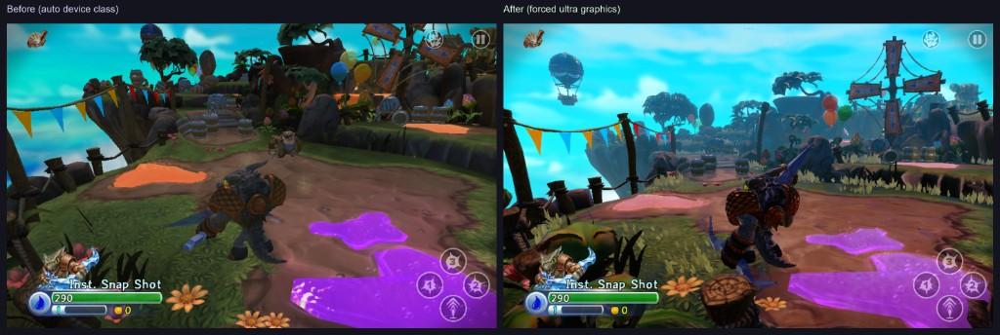

# Skylanders Trap Team — Android Mod (v1.4.1)

Community patch for the original **Skylanders Trap Team** tablet APK (`com.activision.skylanders.trapteam`, version 1.4.1). The stock game no longer runs cleanly on modern Android and its Activision CDN / Google Play OBB pipeline is dead. This mod fixes launch, storage, graphics, Bluetooth portal support, and hosts replacement game assets on a community CDN.

**You must own a legitimate copy of the game.** This project is for preservation and personal use only.

---

## What you get

| Feature | Status |
|---------|--------|
| Install and boot on Android 9–15 | Working |
| Automatic OBB download (~1.25 GB) on first launch | Working |
| Ultra graphics tier on unknown devices | Working (modern APK) |
| Correct UI layout on tall tablets (e.g. Xiaomi Pad 6) | Working |
| Story mode / intro cinematics on Android 14 | Working |
| Bluetooth Portal of Power + gamepad | Working when permissions are granted |
| In-game **Installation Premium** level downloads | **In progress** — see [Known issues](#known-issues) |

The APK itself is only ~15 MB. Almost all game data is downloaded after install.

---

## Which APK to install

| File | Use on |
|------|--------|
| `skylanders-trap-team-modded.apk` | **Android 10–15** (API 29+) — recommended for most devices |
| `skylanders-trap-team-modded-android9.apk` | **Android 9 and below** (API 19–28) |

Both builds share the same OBB, CDN, graphics, display, and Bluetooth fixes. The Android 9 build uses a simpler manifest (no API 31+ Bluetooth permissions, no `POST_NOTIFICATIONS`, no 16 KB page-size compat flag).

---

## Requirements

- **CPU:** 32-bit ARM (`armeabi-v7a`) — the game has no 64-bit native libraries
- **Storage:** ~5 GB free (OBB + initial assets + level cache headroom)
- **Network:** Wi‑Fi or mobile data for first-run downloads
- **Real ARM device** — x86 emulators and most PC “Android” emulators crash in ARM translation (Houdini)

**Tested device:** Xiaomi Pad 6, Android 14 (2880×1800 landscape)

---

## Installation

### 1. Remove any old install (recommended)

If you previously had Trap Team or an older mod build, uninstall it first to avoid stale cache paths. If you need to keep saves, skip uninstall and use `adb install -r` instead (see below).

### 2. Install the APK

- Enable **Install unknown apps** for your file manager or browser.
- Install the APK matching your Android version (see table above).

Via ADB (replace with your device serial if needed):

```powershell
adb install -r skylanders-trap-team-modded.apk
```

Use `-r` to reinstall over an existing copy **without wiping app data**.

### 3. Grant permissions before first play

On **Android 10+**, the game needs runtime permissions for Bluetooth portal support. **Location is required for BLE scanning** on Android 6+ (Google policy — the game does not track your GPS position).

Grant via Settings → Apps → Trap Team → Permissions, or with ADB:

```powershell
adb shell pm grant com.activision.skylanders.trapteam android.permission.ACCESS_FINE_LOCATION
adb shell pm grant com.activision.skylanders.trapteam android.permission.ACCESS_COARSE_LOCATION
adb shell pm grant com.activision.skylanders.trapteam android.permission.BLUETOOTH_CONNECT
adb shell pm grant com.activision.skylanders.trapteam android.permission.BLUETOOTH_SCAN
```

On first launch the game may also prompt for storage and notification permissions — accept them so the OBB download can show progress and complete in the background.

### 4. First launch — OBB download

1. Open the game once.
2. A download screen appears for the main OBB file (~1.25 GB).
3. Progress is shown in-app and in the notification shade. You can leave the app; the download resumes with HTTP Range support if interrupted.
4. When the OBB validates (exact size check), the game **launches automatically** — no manual restart needed.

**OBB details:**

| Field | Value |
|-------|-------|
| Filename | `main.37.com.activision.skylanders.trapteam.obb` |
| Size | 1,343,769,864 bytes |
| URL | `http://trapteam-tablet.skylanderss.com/Tablet2014/obb/main.37.com.activision.skylanders.trapteam.obb` |
| On-device path | `/Android/obb/com.activision.skylanders.trapteam/` |

### 5. After the OBB — bootstrap assets

On first entry to the game, additional bootstrap files download from the community CDN (initial asset zip, content manifest, etc.). This is normal and may take several minutes on a slow connection.

---

## How downloads work

The mod replaces Activision’s dead Google Play expansion flow and CDN with a self-hosted mirror at `trapteam-tablet.skylanderss.com`. The game still uses the original Bedrock download engine internally; only the hostnames and a few Android-side checks were patched.

```text
App launch
  │
  ├─► OBB  (~1.25 GB)
  │     http://trapteam-tablet.skylanderss.com/Tablet2014/obb/main.37....obb
  │
  ├─► Initial assets zip  (~1.15 GB)
  │     .../Tablet2014/android-initial-assets/android-initial-assets-391695.zip
  │
  └─► In-game content (levels, characters, music — on demand)
        │
        ├─► userResources-2418727.json
        ├─► ContentDeploymentManifest.xml.<md5-hash>
        └─► *.iga.<md5-hash>  → cached under DownloadCache/Tablet2014/andc/
```

**Device cache location:**

```text
/Android/data/com.activision.skylanders.trapteam/files/
├── alchemy.xml
└── Cache/DownloadCache/
    ├── urdat_*.json
    └── Tablet2014/andc/
        ├── ContentDeploymentManifest.xml.*
        └── *.iga.*
```

The manifest filename includes an MD5 suffix. The game verifies file content against that hash. If URLs inside the manifest are rewritten without updating the hash suffix, downloads fail silently — the server hosts a corrected manifest (`ContentDeploymentManifest.xml.D64DB2D751F3A6913FCBDEDF69737A0F`).

---

## Bluetooth Portal of Power

The Trap Team **Portal of Power** and bundled Bluetooth gamepad work on Android 10+ after granting the permissions listed above.

**What was fixed:**

- Boot crash when Bluetooth permissions were already granted (`BleManager.suspend()` before `initialize()`)
- Inverted API-level checks in permission helpers
- Native startup deferred until BLE permission flow completes
- BLE scan/connect guarded when permissions are missing; scan continues during level loading
- Android 12+ `BLUETOOTH_CONNECT` / `BLUETOOTH_SCAN` plus **fine location** for legacy scan APIs

**Without a portal:** the game is fully playable with touch controls. Portal pairing is optional.

**Tips:**

- Turn on the portal before launching the game, or use the in-game portal setup screen.
- If scanning fails, confirm location permission is **Allowed**, not “Ask every time” with a stale denial.
- Some Android 14 devices throttle BLE scans aggressively; if pairing is flaky, toggle Bluetooth off/on once.

---

## Graphics (modern APK only)

Stock Trap Team maps unknown tablets to low or mid graphics tiers. The modern build forces **Ultra** (device class 4) via a native patch and raises shader / vertex buffer limits in `alchemy.xml`.



*Left: stock auto device class (blurry distant objects, lower detail). Right: forced ultra graphics patch (sharp textures, full draw distance).*

---

## What was changed (technical summary)

### OBB download

Google Play’s expansion downloader and license verification (LVL) no longer work. Replaced with:

- `ObbHttpDownloader`, `ObbDownloadForegroundService`, `ObbDownloadUiHelper`
- Direct HTTP download from the community CDN with resume support
- Exact byte-size validation before treating the OBB as complete
- Skip re-download when a valid OBB is already present
- Auto-launch `TfbNativeActivity` when ready; no restart loop through the legacy stub

### Android 10–15 compatibility

- New `ModernAndroidCompat` for runtime permissions (storage, notifications, Bluetooth)
- Manifest: `exported` flags, cleartext HTTP allowed, legacy storage, foreground service types, 16 KB page-size compat (Android 15)
- Foreground download notification on API 26+
- Network connectivity fallback so Wi‑Fi is detected correctly on modern Android

### Storage paths

- `performObbTransitionCleanup()` prefers `getExternalFilesDir()` with fallback for scoped storage (Android 11+)
- `TfbNativeActivity.getFilesDirectory()` falls back to `getFilesDir()` if external storage is unavailable

### Bluetooth / boot crash

- Fixed inverted `hasBlePermissions()` API level check and register bug that caused `VerifyError` on launch
- `requestBlePermissions()` / `resetBlePermissionAsked()` in `ModernAndroidCompat`
- `BleManager.initialize()` before native `onCreate`; null-safe `suspend()` / `resume()`

### Story cinematic crash (Android 14)

- **Cause:** `BinkRequestThread` used a 16 KB stack; OpenSL ES audio init overflowed it during the intro video
- **Fix:** Native patch in `libtfbGame_android.so` — thread stack 16 KB → 1 MB

### Display on tall screens

- **Cause:** `cacheScreenSize()` used `Display.getRealSize()` (full display including system bars) instead of the GL viewport
- **Fix:** Use `DisplayMetrics.widthPixels` / `heightPixels`; recache after fullscreen in `onWindowFocusChanged`

### CDN hostname

All Activision tablet CDN URLs in the APK point to `trapteam-tablet.skylanderss.com` instead of `trapteam-tablet.activision.com` (`alchemy.xml`, `strings.xml`, OBB downloader smali).

### Android 9 and below

Separate APK with a simpler manifest. Same OBB, CDN, Bluetooth, Bink, graphics, and display fixes otherwise.

---

## Known issues

### Installation Premium / level downloads (work in progress)

The in-game **Installation Premium** flow (download all level `.iga` assets to device storage) may still show errors such as *“Erreur de téléchargement”* / *“Connexion au serveur perdue”* or *“please wait before downloading”*, even when the CDN returns HTTP 200 from a browser.

**What works today:** OBB download, bootstrap zip, reaching title screen and story mode with assets already cached.

**What is still being debugged:** native Bedrock download path populating `DownloadCache/Tablet2014/andc/` from the premium install dialog. Server-side manifest hash mismatch was fixed; remaining causes may include download cooldown state, navigation to the premium dialog, or native fetch logic.

**Workaround for testers:** pre-seed English level files into DownloadCache via the project’s `push-english-downloadcache.ps1` script (developer tooling — not part of this release package).

### Online services

Activision Bedrock login, friends, cloud saves, and toy-link APIs are **not** restored. Single-player offline content works once assets are present. Swrve analytics and legacy PHP Bedrock endpoints remain pointed at dead Activision hosts.

### Signing

These APKs are debug-signed for community testing. For wide distribution you would replace the keystore and re-sign.

---

## Troubleshooting

| Problem | Things to try |
|---------|----------------|
| **App not installed** | Device may be 64-bit-only with no 32-bit ARM support. Use a real ARM phone/tablet. |
| **OBB download stuck at 0%** | Check Wi‑Fi, disable VPN, confirm ~5 GB free space. Force-stop and reopen the app — partial downloads resume. |
| **OBB loop / restart screen** | Delete incomplete OBB in `/Android/obb/com.activision.skylanders.trapteam/` and relaunch, or clear only OBB-related partial files. |
| **Crash on launch (VerifyError)** | Reinstall the latest mod APK — do not mix smali from older patches. |
| **Portal not found** | Grant location + Bluetooth permissions (see above). Enable location services system-wide. |
| **Blurry graphics** | Install the **modern** APK (Android 10–15 build), not the Android 9 variant if your OS is newer. |
| **UI clipped on tablet** | Same — use the modern build with the display fix. |
| **Stale Activision URLs / old manifest** | Settings → Apps → Trap Team → **Clear storage** wipes saves but fixes cached `urdat_*.json`. Less destructive: delete `files/Cache/DownloadCache/` and `files/Cache/DeviceFileCache/` via a file manager (requires root or ADB on some devices). |
| **“Please wait before downloading”** | Known issue — download cooldown may be active; wait 24h or clear cooldown cache files without full app clear (advanced). |

**ADB reinstall without wiping data:**

```powershell
adb install -r skylanders-trap-team-modded.apk
```

**Force-stop when done testing (recommended for developers):**

```powershell
adb shell am force-stop com.activision.skylanders.trapteam
```

---

## SHA256

```
c6244fc9dc5b46d60ccb1a18059e244545328f272923dedff38e3a6878762a67  skylanders-trap-team-modded.apk
c1b56d0599eb3566ebac1262d2797d33c0e707c072301c0df3ea8a88438c2dc5  skylanders-trap-team-modded-android9.apk
```

Verify after download:

```powershell
Get-FileHash skylanders-trap-team-modded.apk -Algorithm SHA256
```

---

## Legal

This project patches a commercial game for preservation and personal use. **You must own a legitimate copy** of Skylanders Trap Team. Do not redistribute Activision game assets separately from what this mod’s CDN already mirrors for authenticated gameplay.

Skylanders and Activision are trademarks of their respective owners. This project is not affiliated with or endorsed by Activision.
